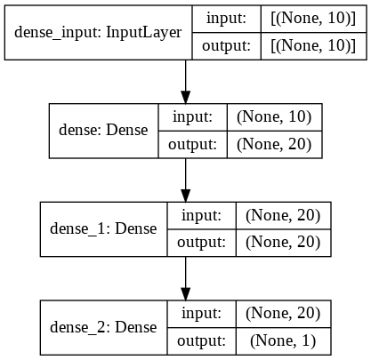
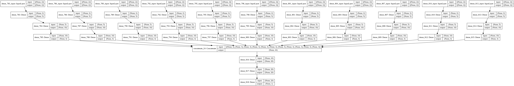
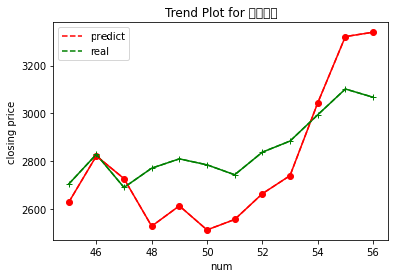
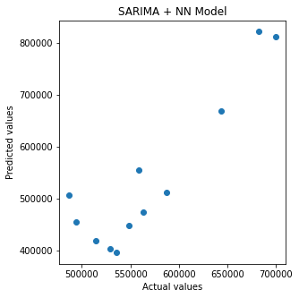

# Predict Chinese Stock Market

中文在下面。

Predict Shanghai Stock Market / Hushen 300 Index monthly closing price using Neural Network.

## Selected Features
### X
- X1: Consumer Price Index
- X2: Business Climate Index
- X3: Industrial Added Value
- X4: Money Supply
- X5: Interbank Lending Rate
- X6: Exchange Rate of RMB to US Dollar (Closing)
- X7: Total Import and Export
- X8: National Financial Expenditure
- X9: Volume of Stock Market (Shanghai)
- X10: Urban Fixed Assets Investment
### Y
- Y1: Shanghai Stock Market (Closing)
- Y2: Hushen 300 (Closing)

[Raw Dataset](Data)

## Trial 1: A simple NN

[Jupyter Notebook](NN/NN.ipynb)

[Dataset](NN/总表.csv)

Using months during 2013-2016 as training set, months during 2017 as test set.

Network Layer:

Not a good model for predict, hardly to see any trend.

## Trial 2: An Improved NN

[Jupyter Notebook](Improved-NN/Improved-NN.ipynb)

[Dataset](Improved-NN/总表.csv)

Using months during 2013-2016 as training set, months during 2017 as test set.

Based on the [simple NN Dataset](NN/总表.csv), four-times entended every variables and the to-predict index and seperately assigning the following four month's data (Just in convenience, you can simply replace those future data with SARIMA generated to make it more practical) . 

Network Layer:

Firstly using PCA to seperatedly reduce the 4-dimensional 11 variables to 2 dimension, then send those data into the network structure below as input data.

(I was planned to add a SVD layer after concatenate, but If added I always got NaN values for loss, maybe I wrote the wrong SVD layer. You can check if there're some mistakes, PRs are welcome.)

Result:

Things seem to improve a lot, trend looks right.

## Conclusion

Simple NNs are short of predicting stock market since they don't have the ability to remember the past. My trial 2 proved that if some memory is added, things can improve. So it's better to use Networks like RNN. 

# 预测中国股市

使用神经网络预测 上证综指/沪深300 月度收盘价。

## 选取的指标
- X1：居民消费价格指数
- X2：企业景气指数
- X3：工业增加值
- X4：货币供应量
- X5：银行间拆借利率
- X6：人民币对美元的汇率（收盘）
- X7：进出口总额
- X8：国家财政支出
- X9：股市成交量（上海）
- X10：城镇固定资产投资额

- Y1：上证收盘
- Y2：沪深300收盘

## 尝试 1：一个简单的神经网络

[Jupyter Notebook](NN/NN.ipynb)

网络结构：

[数据集](NN/总表.csv)

使用 2013-2016 间的月份作为训练集，2017年间的月份作为测试集。

不是一个很好的预测模型，几乎不能看出趋势。

## 尝试 2：一种改进的神经网络

[Jupyter Notebook](Improved-NN/Improved-NN.ipynb)

[数据集](Improved-NN/总表.csv)

使用 2013-2016 间的月份作为训练集，2017年间的月份作为测试集。

基于[简单神经网络使用的数据集](NN/总表.csv)，四次扩展每个变量以及要预测的指数，并分别分配接下来四个月的数据（这是为了方便起见，您可以用生成的SARIMA数据替换这些未来未知的数据，来使其更实用）。

网络结构：

首先利用主成分分析将4维的11个变量分别降维为2维，然后将这些数据作为输入数据送入下面的网络结构中。

（我本来打算在11个神经网络连接之后添加一个SVD层，但是如果添加，我总是得到损失为NaN值，也许SVD层的定义有错误。你可以看看是否有错误，欢迎提交PR。）

结果：

情况似乎改善了很多，能看出一些趋势

## 结论

简单的神经网络缺乏预测股市的能力，因为他们没有记忆过去的能力。我的尝试2证明，如果增加一些记忆，情况会有所改善。所以最好使用RNN这样的网络。